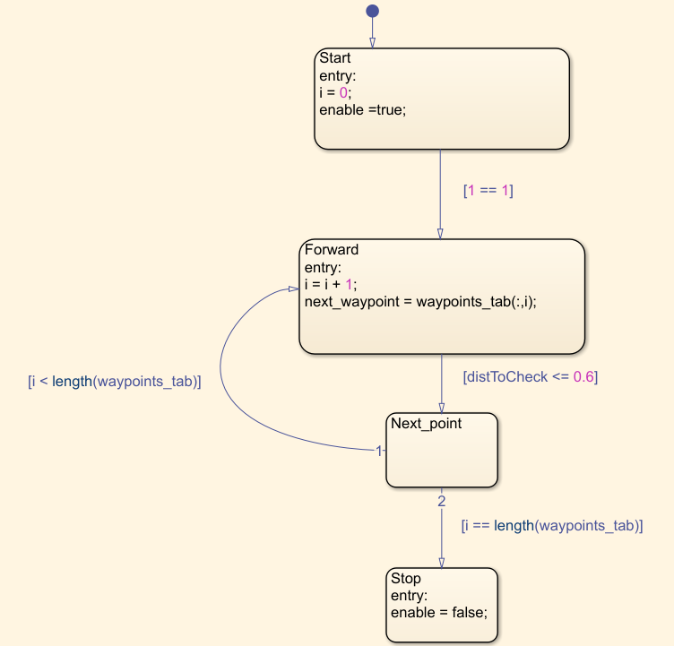

# Snake-Robot

| This project is based on the MathWorks-Excellence-in-Innovation project: [Snake-like Robot Modeling and Navigation](https://github.com/mathworks/MathWorks-Excellence-in-Innovation/tree/main/projects/Snake-like%20Robot%20Modeling%20and%20Navigation). The goal is to make a Simscape Multibody assembly of a snake-like robot and develop an autonomous controller to navigate the robot. | 
  
 |
|:--------------|:-------------:|

## Requirements
In order to properly run the project, the following are needed :
- Matlab R2022b
- Simulink
- Simscape	
- Simscape Multibody	
- Simscape Electrical	
- Stateflow

## How to use the model
In order to test the model, the minimal requirement is to download the [Snake_Robot_v4 model](Snake_Robot_v4.slx). However, it is better to also download the [joint_control_analysis](joint_control_analysis.m) and [snake_path_analysis](snake_path_analysis.mlx) scripts for a better understanding of its behavior:

- *joint_control_analysis* is used to analyze the behavior of each joint. It plots one figure per joint with the comparison of the desired position and the actual position of the joint over time.
- *snake_path_analysis* is used to analyze the path of the snake and the behavior of the navigation algorithm. It plots three graphs. The first one is the path of the snake overtime and the defined waypoints. The second one is a comparison of the actual direction and desired direction of the snake over time. The last one is for checking that the custom unwrap block works properly. It is a plot of the heading angle before and after the unwrap block. 

The robot can be controller either automatically or manually using the switch. The mode can be changed from auto to manual during the simulation, but **doing the opposite sometimes causes some issues**.

Here is a preview of the snake working in autonomous mode:

https://user-images.githubusercontent.com/113728365/234494054-d72cbcf5-38b2-45fc-a58d-7ca29e69785d.mp4

### - Manual navigation
Once the switch is set to manual mode, you can control the direction of the snake using the knob :

  

### - Autonomous navigation
For the autonomous navigation, the path is defined by waypoints. It is important that the path defined by the waypoints is as smooth as possible.

**Consecutive waypoints must not have an angle > 90 degres !**

This is an example of a well defined path :

  

The waypoints are set through the waypoints tab in the model.

## How does it work ?
Like real snakes, the robot uses anisotropic friction with the ground to move and steer. Anisotropic friction is mandadory in order to be able to control it. I used wheels for this purpose. I also tried to model the anisotropic friction without wheels, you can explore the [Tests](https://github.com/Antoine-ms/Snake-Robot/tree/main/Tests) folder. I succeded in modeling the anisotropic friction without the wheels, but I was not able to get the snake to properly move. Moreover, wheels are easier to simulate and easier to implement in a real build. However, they are very resources demanding in a simulation.

The serpentine motion is implemented using a sine wave with a offset (phase) for each joint. Each joint uses a PID controller. 

The steering of the snake is done by adding an bias (offset) to the input of each joint : 

The heading of the snake is computed by taking the mean of all the orientation of the head during one period. The desired direction of the snake is computed using the (x,y) coordinates of the head and of the next waypoint. The heading and the desired direction are computed using the atan2 block. Therefore, a custom unwrap block has been added to deal with the discontinuity at -pi/pi. Finally, a PD controller is used to compute the steering bias. 

A Stateflow chart is used to determine when the snake has reached the waypoint, and to set the next waypoint. The snake automatically stops when it reaches the last waypoint. 

  

## License
[BSD 2-Clause Simplified License](https://choosealicense.com/licenses/bsd-2-clause)
